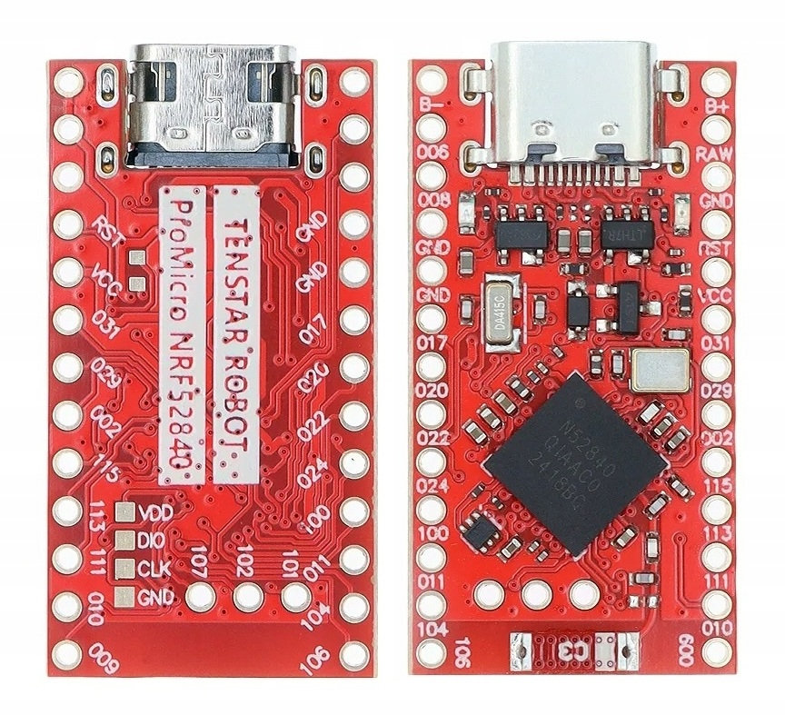
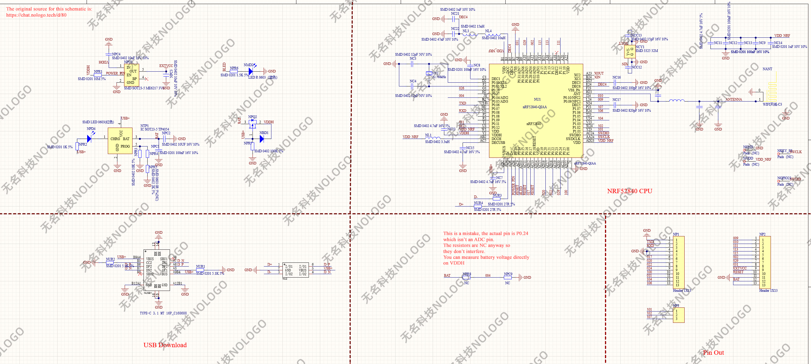

# nRF52840 ProMicro

The nRF52840 ProMicro board is also known as the SuperMini board. It's a clone of the nice!nano board with a mix of v1 and v2 design features. The schematic is available online, albeit with a small mistake, but I was unable to find board design files. The aim of this repository is to reverse engineer the board design and determine which component is which so that I can desolder them from the board and reuse them on my custom PCB.

# Schematic
This is the original schematic as posted on https://chat.nologo.tech/d/80. The voltage divider for the battery is marked as being connected to P0.04, which is an analog input pin. On the actual board it's connected to P0.24 instead, which makes it unsuitable for battery voltage measurements. Instead you can measure the battery directly on VDDH pin, but the voltage will rise when USB is plugged in.

# KiCad project
The project in the KiCad folder is my attempt at replicating the board to identify every component's location. The USB connector is not the correct footprint, but the name in the schematic is correct. KiCad doesn't seem to have a footprint for the antenna, but the model is CA-C03.
